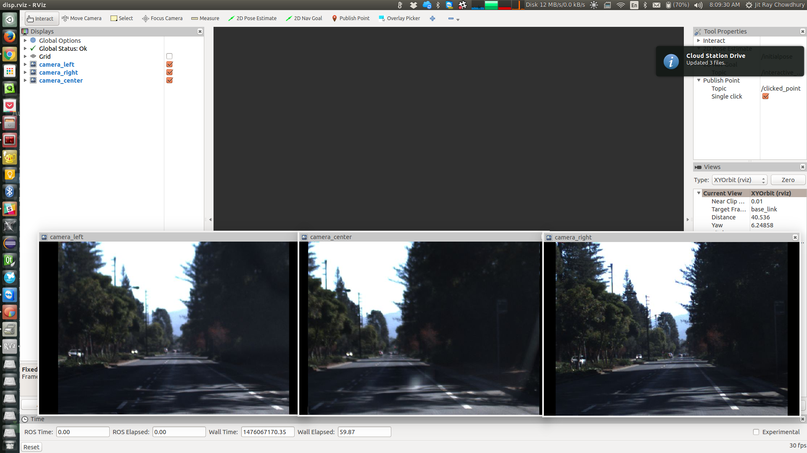
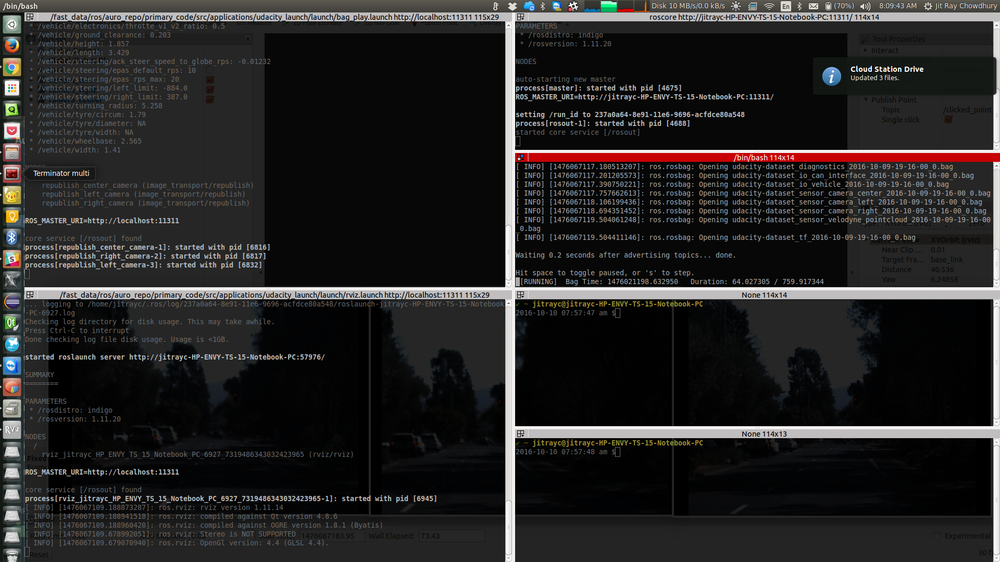

Dataset download
================
Download either the contents of folders as needed or entire folder.

Example: Contents of udacity-dataset-2-1 or udacity-dataset-2-1.tar.bz2


```
##To utilize compressed image topics
##=================================
##You need the install the dependecy
$sudo apt-get install ros-indigo-image-transport*

##To play back data
##=================
##copy the udacity_launch package to you catkin workspace,
##compile and source so that it is reachable.

$cd udacity-dataset-2-1
$rosbag play --clock *.bag
$roslaunch udacity_launch bag_play.launch

##For visulization
$roslaunch udacity_launch rviz.launch

##To log data in separate bagfiles and compressed image
##====================================================
$roslaunch udacity_launch logging.launch bagPath:="/media/Data/UdacitySDC/udacity-datasetN"

##To convert existing log to seperate bagfiles and compressed image
##================================================================
$rosbag  play --clock old_single_huge_bagfile.bag
$roslaunch udacity_launch logging.launch republish_raw2compressed_images:=true bagPath:="/media/Data/UdacitySDC/udacity-datasetN"

##Compressed bagfiles
##================================================================
##Each of the bagfiles are already compressed, so there is no benefit
##of compressing the folders to compressed file other than having a single file
##for the whole folder.
##The bagfiles decompress on the fly and may cause slower performance and you
##may want to decompress them before you run, size would increase by around 10% only.

$rosbag decompress *.bag

```
Play the ROS .bag

